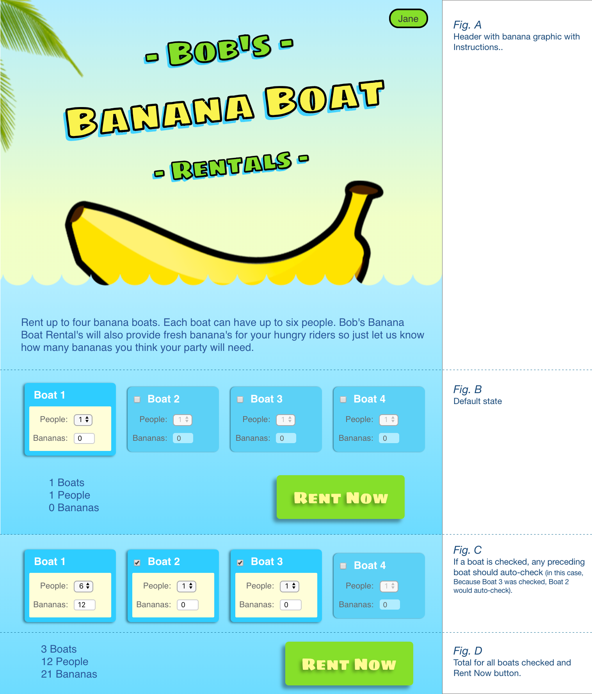

# Banana Boat


## Using [Unstated](https://github.com/jamiebuilds/unstated) for managing state in React apps

Let's say your client 'Bob' want's you to build a bannana boat rental app. Your into React so you ```creact-react-app bannana-boat``` and take a look at the mockup the UX department sent over.



Getting past the corny graphics the UI shows the user 'Jane' 4 similar looking controls. One of them is active while the other have a checkBox for activation. For each 'active' boat control Jane can select up to 6 people as well as input the number of bananas each boat will take.

So we'll need a reusable stateful Boat component to keep track of if the boat is selected and if so how many people/bananas the user is planing for. Notice the 'if' in that last sentence, that means we'll need some component logic to determine behavior, in this case disabling inputs and changing some CSS properties and by 'keep track of' means the components local state.

We'll also need to keep application/global state on all the Boat components and their local state. There are a lot of solutions and patterns for managing global state in React apps but for the sake of this app we'll use one put out from Jamie Builds that uses React's context API to make for a simple state management solution that extends on React's own setState method.

Unstated gives use three components for working with application state, Containers, Providers, and Subscribers.

### Containers
Containers give us a place to setup some application state along with methods to update that state.
From the docs:

`Container is a very simple class which is meant to look just like React.Component but with only the state-related bits: this.state and this.setState`

`setState() in Container mimics React’s setState() method as closely as possible.`

So calling setState() in the Container will cause any component subscribed to re-render. One refreshing difference is Unstated's setState() returns a promise so you can use `async` and `await` in your update methods.

### Providers
Provider components are used to store the Container instances and allow it's children to subscribe to the instances. Providers should wrap the top most component that will subscribe to a container.

### Subscribers
Subscribers are components that take a `to` render prop to pass state and methods from the Container into your component. Note: The `to` prop takes an array so you can pass multiple state container instances to the component.

With that, let's turn back to our banana boat app and set up a BoatsContainer for our application state.

```
<!-- BoatsContainer.js -->

import { Container } from 'unstated';

class BoatsContainer extends Container {
  constructor() {
    super();
    // Hydrate Global state from localStorage if available
    localStorage.getItem('boats') && localStorage.getItem('totals')
      ? this.setState({
          boats: JSON.parse(localStorage.getItem('boats')),
          totals: JSON.parse(localStorage.getItem('totals'))
        })
      : console.log("localStorage empty");
    // Else start fresh
    this.state = {
      boats: [
        {
          enabled: true,
          peopleCount: 1,
          bananaCount: 0
        }, ...
      ],
      totals: {
        boats: 1,
        people: 1,
        bananas: 0
      }
    }
  };

  setPeopleCount = async (boatNum, val) => {
    ...
  }

  setBananaCount = async (boatNum, val) => {
    ...
  }

  disableBoats = async (boatNum) => {
    ...
  }

  enableBoats = async (boatNum) => {
    ...
  }

  calcTotals = async () => {
    ...
  }
```

This give us a boats array where each item in the array has a boolean flag for enabled, along with a peopleCount and bananaCount property. I've added methods for setting the count on each boats people/bananas, enabling/disabling a boat and one for calculating the totals of all boats. We also need to persist the state on browser refresh so along with setting the state our methods also will save to the browsers localStorage. That way when the component is instantiated we can check if localStorage has our state and just hydrate our app state to that or if not then set to our defaults.

We will import this into our BoatCard.js component along with Unstated's Subscribe component. With this we use the Subscriber in our render() method and pass the BoatsContainer to it's `to` render prop.

```
<Subscribe to={[BoatsContainer]}>
  {boatLoad => (
    <!-- Some JSX -->
  )}
</Subscribe>
```
Now we have access to BoatsContainers state and methods through our boatLoad variable.

In our main App.js comoponent we will also need to Subscribe to BoatsContainer to access the our applications totals state and finnaly we wrap it all in Unstated's Provider component to get it all working.
```
<Provider>
  <Subscribe to={[BoatsContainer]}>
    {boatLoad => (
      ...
    )}
  </Subscribe>
</Provider>
```

As the app and state grows we could add to BoatsContainer or separate app state out to more logical state Containers to use where needed. Overall this give us an easy React like way to manage state in our app and keeps things simple.

To try out Bob's Banana Boat app clone this repo and use yarn or npm to run the necessary react scripts.

#### `yarn start`

Runs the app in the development mode.<br>
Open [http://localhost:3000](http://localhost:3000) to view it in the browser.

#### `yarn test`

Launches the test runner in the interactive watch mode.<br>

#### `yarn build`

Builds the app for production to the `build` folder.

Thanks for checking this repo out and let me know if you have any questions, sugestions or comments.
